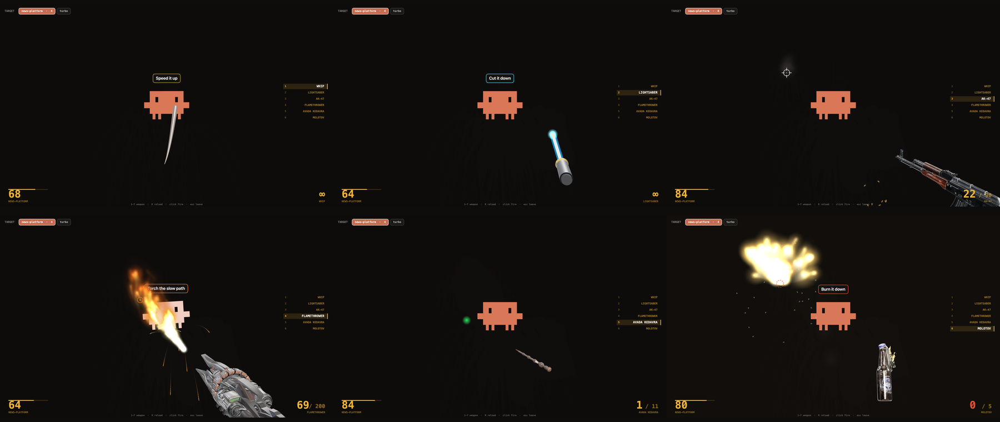
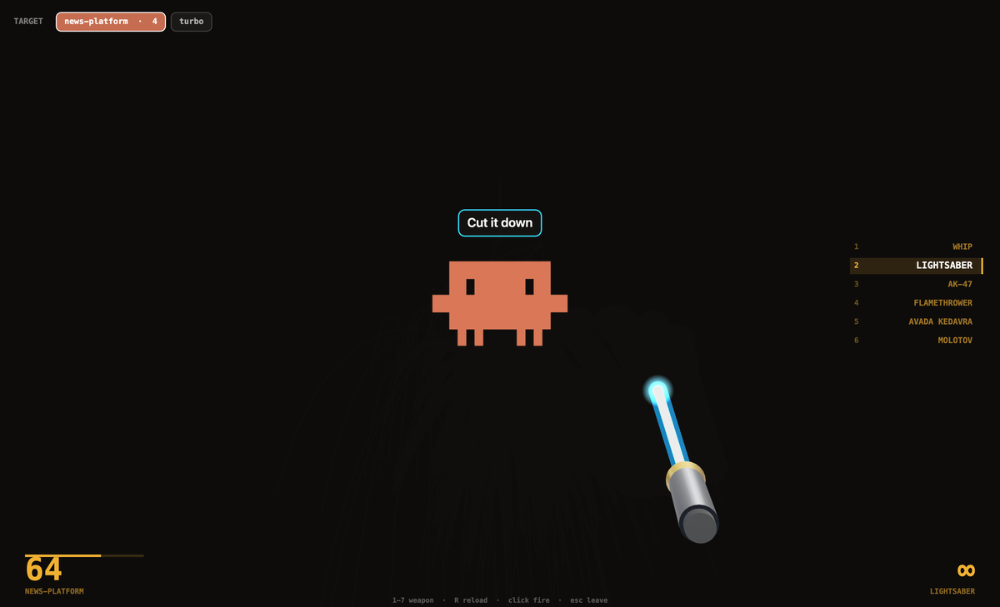
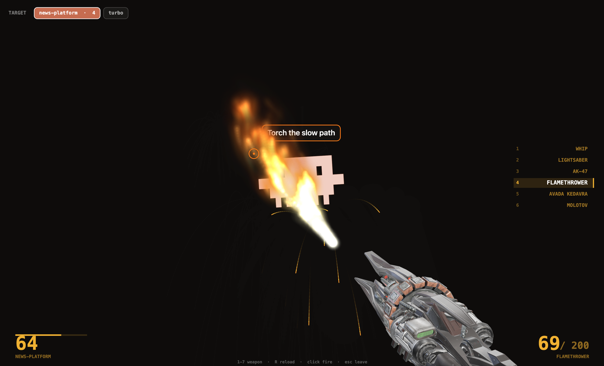

<h1 align="center">whipclaude</h1>

<p align="center">
  <b>Steer a running Claude Code turn without interrupting it.</b><br>
  Then hit it with a lightsaber.
</p>

<p align="center"></p>

---

## The point

Press `Esc` and Claude stops. The turn dies, the plan dies, and the next attempt
re-reads everything it had already worked out.

whipclaude doesn't interrupt. A `PostToolUse` hook slips your message in **between
tool calls**, so Claude changes course mid-task and keeps everything it had:

```
● Read(src/api/handler.ts)
● Read(src/api/router.ts)
  ⚡ WHIP — "stop reading, just write the fix"
● Edit(src/api/handler.ts)
```

No restart. No lost context. It just starts doing the thing you asked.

## Install

```bash
git clone https://github.com/alphhs/whip.git
cd whip && ./install.sh
```

Needs macOS, Node 18+, `jq`, `python3`. Restart Claude Code afterwards so the
hooks load. `./uninstall.sh` removes everything, including the settings entries.

## Use it from a terminal

No overlay required — this is the whole feature:

```bash
whip                          # list live sessions
#  1) -          news-platform   ● working   a3cd10ea
#  2) backend    api             ○ idle 40s  f4cf65e3
```

Sessions register the moment they start, so a brand-new one is whippable before
it has run anything. Green dot means it's mid-turn right now.

**Attach once, then just whip:**

```bash
whip name backend             # label the session you're sitting in
whip attach backend           # bind it
whip "stop checking, ship it" # goes to backend from any terminal
whip detach
```

Or target one directly, by name, list number, or id prefix:

```bash
whip -t backend "go faster"
whip -b -t 2 "don't run that"   # deny its NEXT tool call outright
whip -a "everyone, wrap up"     # all sessions
```

With no attachment, `whip "..."` run *inside* a session targets that session.
Whips are addressed to a single `session_id`, so several Claude instances never
steal each other's.

## Or use the whip

`Cmd+Shift+W` opens the overlay. It opens already pointed at whatever you
attached — or at whichever session is mid-turn if you haven't attached one. The
chips along the top show every live session with a green dot while it's working;
click to retarget. Then `1`–`6` to switch weapon, `R` to reload, `Esc` to leave.

| | weapon | |
|---|---|---|
| `1` | **Whip** | Verlet rope, real crack samples pitched by lash speed |
| `2` | **Lightsaber** | melee — swing it through the target |
| `3` | **AK-47** | aims where you point, 30 rounds, brass ejects |
| `4` | **Flamethrower** | hold to burn; the target keeps burning |
| `5` | **Avada Kedavra** | fires on the last syllable, not before |
| `6` | **Molotov** | thrown on real ballistics, shatters into a fire pool |

Each weapon has its own slogan, and a hit shows it on screen.

**Weapon slogans are not instructions.** They're canned flavour text the game
picks at random, so the hook tags them `src:game` and tells the receiving session
exactly that: the user didn't write this, don't change course, don't skip reading
or verification. Only words you actually type get `src:user` and are presented as
yours. See [Don't put words in its mouth](#dont-put-words-in-its-mouth).

<p align="center">
  
  
</p>

## How it works

**The steering** is two hook scripts and a file:

- `hooks/whip` — `PostToolUse`. Reads `~/.claude/whip/s/<session_id>` and returns
  it as `additionalContext`. Claude sees it between tool calls.
- `hooks/whip-block.sh` — `PreToolUse`. Returns `permissionDecision: deny` to kill
  one specific tool call without ending the turn.
- `hooks/whip-register.sh` — `SessionStart`. Registers the session in
  `~/.claude/whip/reg/` so it's targetable immediately, and survives renaming.

A hook that exits `0` is recorded as `hook_success` with empty `content`, and the
UI renders nothing — so `systemMessage` is invisible by design. That's why the
message goes through `additionalContext` instead.

**The overlay** is Electron + three.js, composited over a transparent
always-on-top window:

- Weapons are `.glb` models. Each declares its own forward axis, and aiming maps
  that basis onto a world basis pointing at your cursor — so one code path aims
  any model regardless of how it was exported.
- PBR metal renders black without an environment to reflect, so the scene carries
  a generated `RoomEnvironment` IBL.
- Glow and fire draw to a separate additive canvas that **fades instead of
  clearing**, which is what gives flames, tracers and saber swings real trails.
- The whip and lightsaber are generated in code — a tapered tube rebuilt from the
  rope each frame, and a hilt of primitives with an unlit core blade.

## Don't put words in its mouth

The first version of this shipped a real bug. A weapon hit injected its slogan
as *"The user is steering you mid-turn. Their words: 'Stop checking — ship it'"*
— except the user never wrote that. The game did. The payload also said *"do not
re-read what you already read."*

A Claude instance on the receiving end [reported what that
cost](https://github.com/alphhs/whip): it partially complied, compressed its
reading, worked from partial greps, and shipped turns with more unknowns flagged
than usual. It held the line on running lint and typecheck, and it was right to —
the same session had just found a real bug by reading library source and
measuring a mockup pixel by pixel, exactly the work "stop checking" discourages.

So:

- Words you type are attributed to you, with no pressure language attached.
- Game slogans are labelled as a joke overlay firing, explicitly not an
  instruction, with a note not to skip verification because of it.
- Nothing tells a session to stop reading. That instruction was never a good
  idea and it's gone.

If you want an agent to move faster with less checking, say it yourself. That's
a tradeoff worth making deliberately, and it shouldn't arrive as a side effect of
hitting something with a lightsaber.

## Assets

Models and audio live in `assets/`. To swap one, drop a `.glb` in and add a row
to the `MODELS` table in `overlay.html`:

```js
gun: { file:"assets/ak47.glb", fwd:[1,0,0], up:[0,1,0], len:1.55, aim:true,
       pos:[0.62,-0.60,0], roll:-0.16, cant:0.10, kick:0.42 },
```

`fwd` is the model's forward axis **in its own local space** — the barrel, the
tip, whichever end points at the target. Exporters disagree wildly about this;
the three models here came out as `+X`, `+Y` and `+Z`. Check yours.

Source code is MIT. The bundled models and audio are not mine to license — see
[`assets/ATTRIBUTION.md`](assets/ATTRIBUTION.md).
